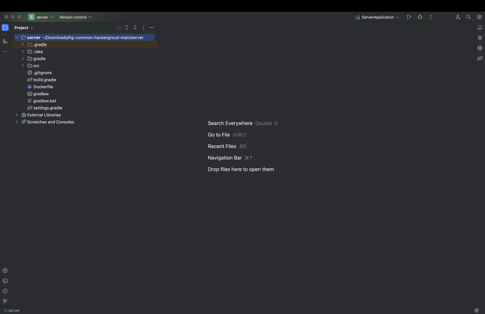
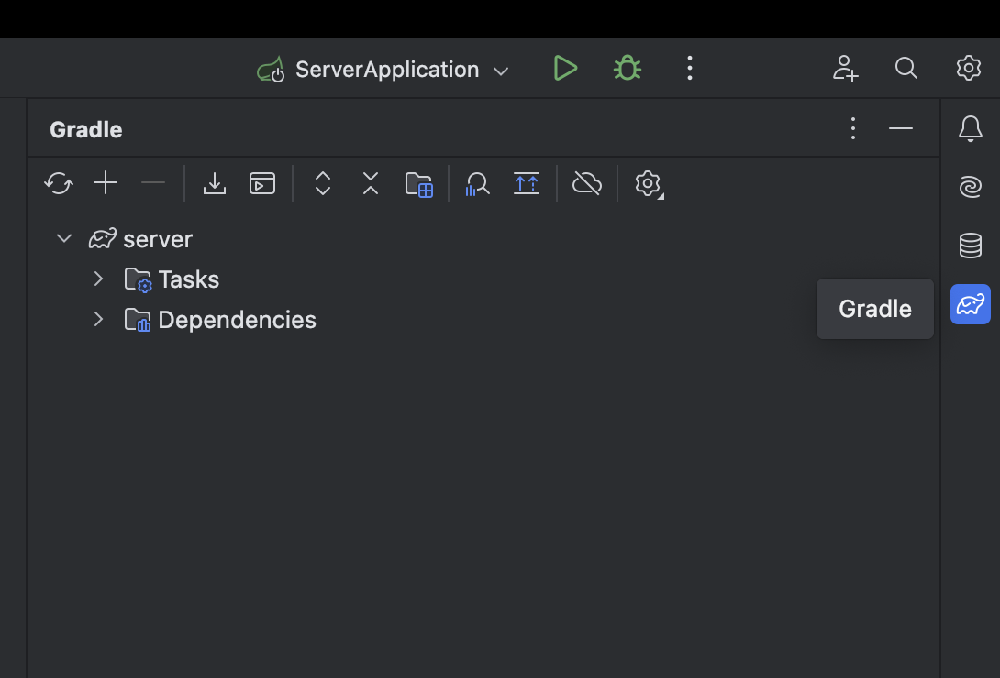
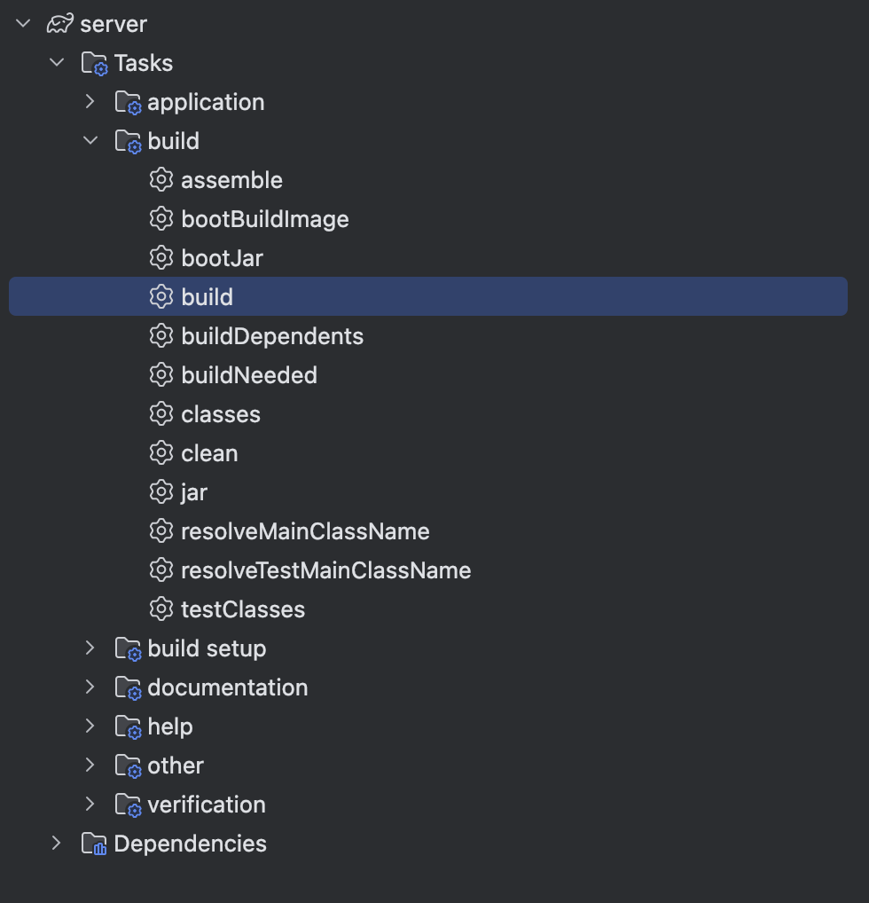

해커그라운드 해커톤에 참여하는 `common` 팀의 `백수였던 내가 이세계에선 의성 시장?`입니다.

## 참고 문서

> 아래 두 링크는 해커톤에서 앱을 개발하면서 참고할 만한 문서들입니다. 이 문서들에서 언급한 서비스 이외에도 더 많은 서비스들이 PaaS, SaaS, 서버리스 형태로 제공되니 참고하세요.

- [순한맛](./REFERENCES_BASIC.md)
- [매운맛](./REFERENCES_ADVANCED.md)

## 제품/서비스 소개

<!-- 아래 링크는 지우지 마세요 -->
[제품/서비스 소개 보기](TOPIC.md)
<!-- 위 링크는 지우지 마세요 -->

## 오픈 소스 라이센스

<!-- 아래 링크는 지우지 마세요 -->
[오픈소스 라이센스 보기](./LICENSE)
<!-- 위 링크는 지우지 마세요 -->

## 설치 방법

> **아래 제공하는 설치 방법을 통해 심사위원단이 여러분의 제품/서비스를 실제 Microsoft 애저 클라우드에 배포하고 설치할 수 있어야 합니다. 만약 아래 설치 방법대로 따라해서 배포 및 설치가 되지 않을 경우 본선에 진출할 수 없습니다.**
>
> 안녕하세요 친애하는 운영진분들 운영하시느라 수고가 많으십니다 항상 감사합니다 ☺️

### 사전 준비 사항

> **여러분의 제품/서비스를 Microsoft 애저 클라우드에 배포하기 위해 사전에 필요한 준비 사항들을 적어주세요.**
인텔리제이, 도커 데스크탑, 도커 엔진, Azure 계정 (Hackerground에 권한이 있는), 깃허브 계정, 자바 jdk-17 , 맥북으로 배포 절차를 구성하였습니다 맥북으로 진행해주세요.

## 시작하기

> **여러분의 제품/서비스를 Microsoft 애저 클라우드에 배포하기 위한 절차를 구체적으로 나열해 주세요.**


먼저 이 레포지토리를 다운받아줍니다. 오른쪽 위 "<>Code" 가 적힌 초록 버튼을 누른 뒤 Download Zip을 클릭합니다.


다운을 받은 파일을 압축 해제해주세요.

압축 해제 후 인텔리제이를 켜주세요.


오른쪽 위에 open 이라 적힌걸 클릭합니다.


다운로드로 이동하여 저희가 아까 받은 파일을 클릭한 뒤 서버 폴더를 찾아 클릭 후 열기를 클릭 합니다. (이미지를 참조해주세요)


이미지처럼 경고창이 뜬다면 Trust Project 클릭해주세요.



이런 화면에서 오른쪽에 코끼리 모양(Gradle) 아이콘을 클릭해주세요.



Tasks 폴더를 클릭해주세요.



build 폴더를 더블 클릭 후 build를 찾아 더블 클릭해주세요.

왼쪽 위 빨간 창 닫기 버튼을 통해 인텔리제이 초기화면으로 돌아갑니다.


다시 오른쪽 위 open을 클릭한 뒤 다운로드에서 저희가 아까 받은 파일을 클릭하고 열기를 클릭해주세요. 


(이미지를 참조해 열기를 클릭해주세요.)


이미지처럼 경고창이 뜬다면 Trust Project 클릭해주세요.


프로젝트가 이렇게 켜졌다면 반정도 성공하신겁니다. <br>
~~여기까지 하셨다면 체크포인트 느낌으로 저한테 해커그라운드 잡담방에 중간정도완료!! 보내주세요...ㅎ 가능하시면...말이죠..~~


오른쪽 아래에 네모 안에 |>_| 이렇게 생긴거 클릭해주세요.

```bash
curl -fsSL https://aka.ms/install-azd.sh | bash
```

이 명령어를 쳐서 azd를 깔아줍니다.

```bash
azd auth login
```

이 명령어를 통해 azd에 로그인해주세요.

```bash
azd auth login --check-status
```

로그인이 끝났다면 로그인이 재대로 되었는지 명령어를 쳐 확인해주세요.
로그인이 안됬다면 될때까지 저 과정을 무한반복하세요 그만두지 말고 무한반복하세요.

로그인 체크가 완료되었다면 명령어창에 아래와 같이 입력합니다.

```bash
azd init -e common-hackergroud
```


Use code in the current directory에 초록이 뜬 채로 엔터를 클릭합니다.


앤터 후 위와 같은 화면에서도 Confirm and continue initializing my app에 초록이 뜬채로 앤터를 클릭합니다.
 
What port does 'web' listen on? 라고 물어보면 80을 적습니다.

Overwrite with versions from template에 초록 화면을 뜬채로 앤터를 클릭합니다.

SUCCESS: Your app is ready for the cloud!

라고 명령어창에 떴다면 3/2를 성공하신겁니다.
~~여기까지오셨다면 3/2 도착이라고 해커그라운드 잡담방에 올려주세요(가능하면요)~~

파일중에 azure.ymal 파일이 있을껍니다.

클릭하신뒤 안에 내용을 지우시고 아래 내용을 복사한 뒤 붙혀넣어주세요.

```yml
name: hg-common-hackergroud
metadata:
    template: azd-init@1.9.5
services:
    server:
        project: server
        host: containerapp
        language: java
    web:
        project: web
        host: containerapp
        language: ts
        dist: build
        docker:
            path: Dockerfile
```

그 다음 명령어창에 아래와 같이 작성하세요.

```bash
 azd up
```

Select an Azure Subscription to use 를 물을껀데 그때 Hackers Ground 리소스 그룹을 선택하세요. 선택후 앤터를 누르시면 됩니다.

Select an Azure location to use 를 물어보면 13. (Asia Pacific) Korea South (koreacentral) 에 초록불이 들어오도록 한 뒤 앤터를 클릭합니다.

그리고 기다려주세요. 5~10분정도 소모됩니다.

SUCCESS: Your up workflow to provision and deploy to Azure completed in 2 minutes 22 seconds.

가 뜨신다면 배포 성공 🎉

배포는 성공하셨으니 추가점수를 받으러 가볼까요~!

**깃허브 액션 구성하기**


