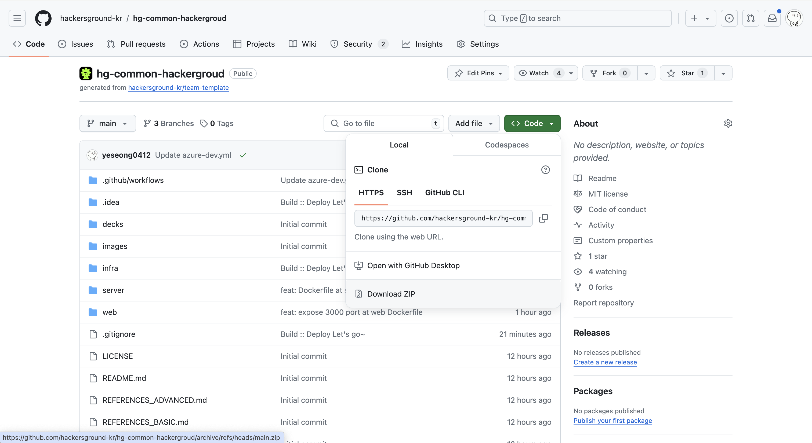
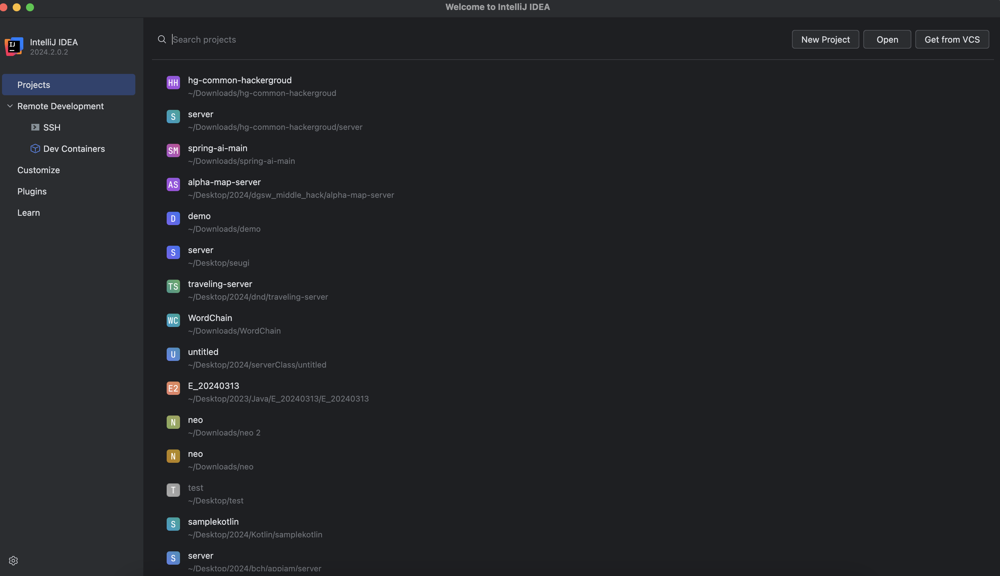
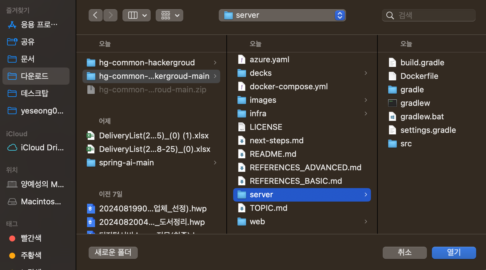
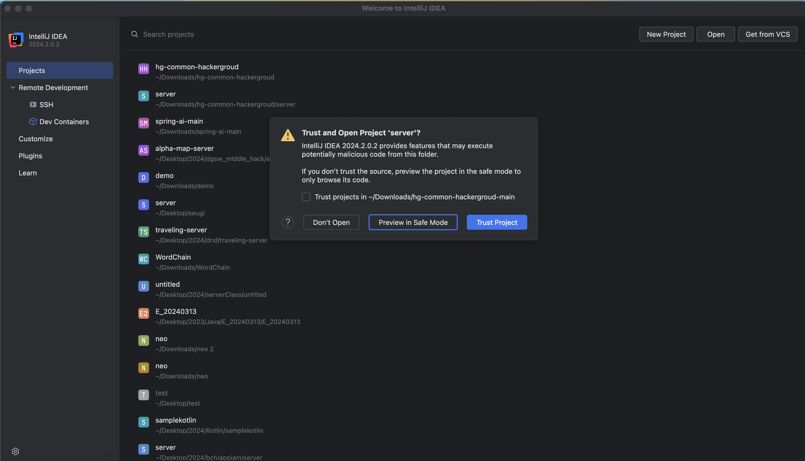
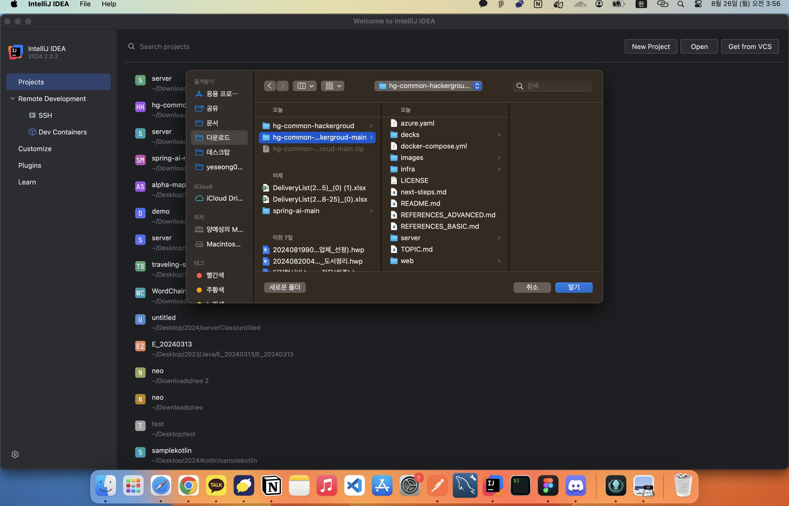
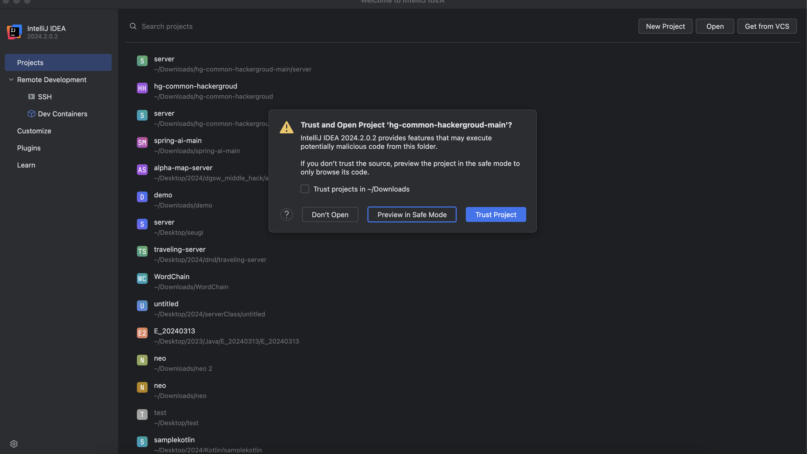
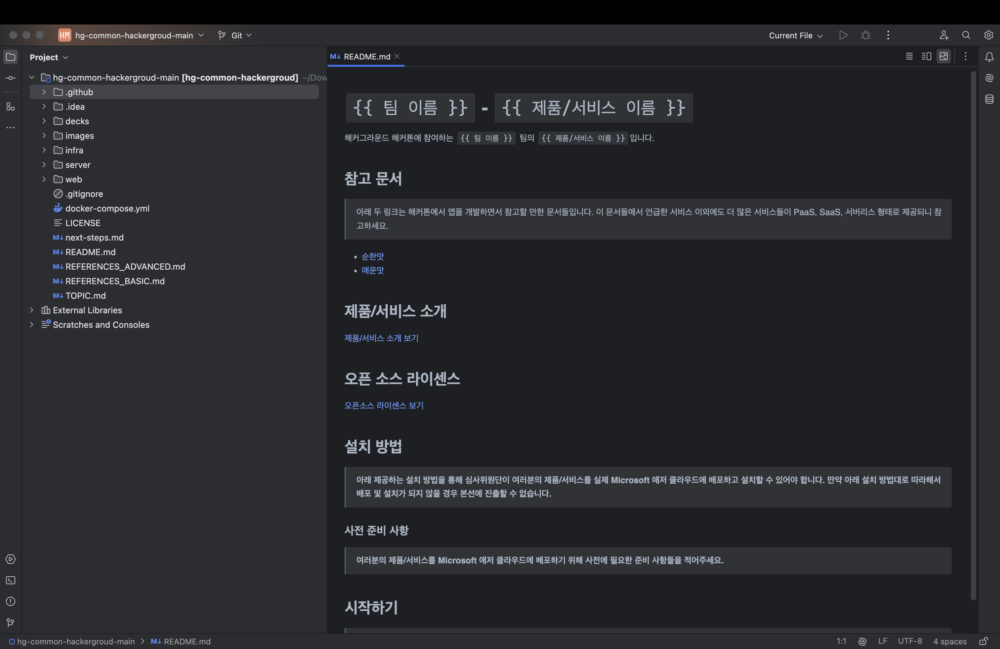
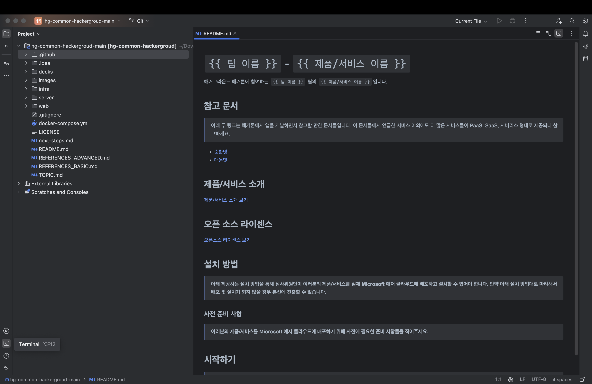
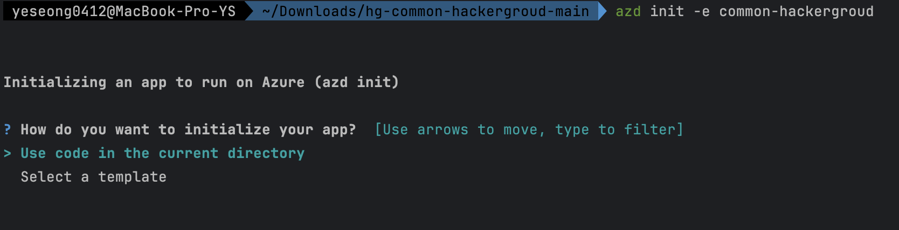
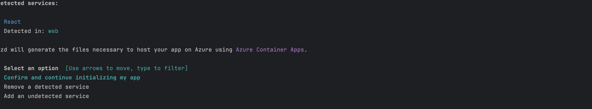

# `common` - `백수였던 내가 이세계에선 의성 시장?`

해커그라운드 해커톤에 참여하는 `common` 팀의 `백수였던 내가 이세계에선 의성 시장?`입니다.

## 참고 문서

> 아래 두 링크는 해커톤에서 앱을 개발하면서 참고할 만한 문서들입니다. 이 문서들에서 언급한 서비스 이외에도 더 많은 서비스들이 PaaS, SaaS, 서버리스 형태로 제공되니 참고하세요.

- [순한맛](./REFERENCES_BASIC.md)
- [매운맛](./REFERENCES_ADVANCED.md)

## 제품/서비스 소개

<!-- 아래 링크는 지우지 마세요 -->
[제품/서비스 소개 보기](TOPIC.md)
<!-- 위 링크는 지우지 마세요 -->

## 오픈 소스 라이센스

<!-- 아래 링크는 지우지 마세요 -->
[오픈소스 라이센스 보기](./LICENSE)
<!-- 위 링크는 지우지 마세요 -->

## 설치 방법

> **아래 제공하는 설치 방법을 통해 심사위원단이 여러분의 제품/서비스를 실제 Microsoft 애저 클라우드에 배포하고 설치할 수 있어야 합니다. 만약 아래 설치 방법대로 따라해서 배포 및 설치가 되지 않을 경우 본선에 진출할 수 없습니다.**
<br>
안녕하세요 친애하는 운영진분들 운영하시느라 수고가 많으십니다 항상 감사합니다 ☺️

### 사전 준비 사항

> **여러분의 제품/서비스를 Microsoft 애저 클라우드에 배포하기 위해 사전에 필요한 준비 사항들을 적어주세요.**
준비사항이 의미가 없군요..

### WINDOW 설치 가이드 (MAC OS인 경우 하단으로 스크롤 하여 "MAC 설치 가이드"를 따르세요.)

https://www.jetbrains.com/ko-kr/idea/download/ 에 접근하여 스크롤을 내려 

빨간색으로 마킹 된 버튼을 눌러 다운로드 합니다.

다운로드된 파일을 실행하여 다음과 같이 오른쪽 하단의 "다음" 버튼을 게속 누릅니다.


다음과 같이 컴퓨터를 재시작합니다.

윈도우 검색창에 intellj 를 검색하여 IDE를 실행합니다.


약관에 동의후 오른쪽 하단의 계속 버튼을 누릅니다.


오른쪽 하단의 "보내지 않음" 버튼을 누릅니다.


이후 인텔리제이 프로그램을 종료합니다.

<br>
https://www.docker.com/products/docker-desktop/

위 링크를 클릭해 사이트에 접속 후 약 3초 기다렸다가 아래 이미지와 같이 다운로드합니다.


그후 다운로드 된 파일을 실행해 오른쪽 하단의 "OK"버튼을 누릅니다.


설치를 기다린 후 CLOSE AND RESTART 버튼을 누릅니다.


재부팅 후 표시되는 화면에서 오른쪽 하단의 Accept 버튼을 누릅니다.


오른쪽 하단의 finish 버튼을 누릅니다.


이후 만약 아래와 같은 화면이 표시된다면 아래의 가이드를 따라주시고 아니라면, 아래 시작하기 섹션까지 스크롤 해주세요.


왼쪽 하단의 검색 아이콘을 클릭한 후 아래 이미지처럼 cmd를 입력후 관리자 권환으로 실행합니다.


아래 이미지와 같이 `wsl --update`, `wsl --shutdown`을 차례대로 입력합니다.


그후 다시 왼쪽 검색창에서 docker 를 검색후 실행합니다.


위의 가이드처럼 다시 FINISH를 누르고 회원가입을 하라면 회원가입, 로그인 하라면 로그인 하고 설치 혹은 사용하세요.<br>

### MAC 설치 가이드

https://www.jetbrains.com/ko-kr/idea/download/


첨부한 링크를 들어가서 다운로드쪽 파란걸 확인해주세요

<br><br>

만약이 쿠키 관련 창이 뜨면 창 닫기 해주세요.

<br>

<br>

본인 컴퓨터에 맞게 깔아주시면 좋을 것 같습니다.

<br><br>

본인 컴퓨터가 Intel인지 Apple Silicon인지 모른다?

<br><br>

저거 선택하면 바로 다운로드 시작됩니다.


다운 다받으셨으면 더블클릭으로 열어주시고요


마우스를 꾹 눌러 Application으로 이동시켜주세요.

<br>

그러면 인텔리제이 Mac 설치가 완료됩니다.

회원가입을 하라면 회원가입, 로그인 하라면 로그인 하고 설치 혹은 사용하세요.<br>
<br>

아래 이미지에서 오른쪽 Download for Mac - [Apple Silicon 또는 Intel Chip을 자신의 노트북에 맞게 설치합니다.] 을 누릅니다.


그 후 파일의 설치가 모두 끝났다면 파일을 실행해 아래 왼쪽의 이미지를 오른쪽 폴더로 끌어 이동시킵니다.


그후 Docker Desktop을 실행합니다.
회원가입을 하라면 회원가입, 로그인 하라면 로그인 하고 설치 혹은 사용하세요.<br>

## 시작하기

> **여러분의 제품/서비스를 Microsoft 애저 클라우드에 배포하기 위한 절차를 구체적으로 나열해 주세요.**


먼저 이 레포지토리를 다운받아줍니다. 오른쪽 위 "<>Code" 가 적힌 초록 버튼을 누른 뒤 Download Zip을 클릭합니다.



다운을 받은 파일을 압축 해제해주세요.

압축 해제 후 인텔리제이를 켜주세요.



오른쪽 위에 open 이라 적힌걸 클릭합니다.



다운로드로 이동하여 저희가 아까 받은 파일을 클릭한 뒤 서버 폴더를 찾아 클릭 후 열기를 클릭 합니다. (이미지를 참조해주세요)



이미지처럼 경고창이 뜬다면 Trust Project 클릭해주세요.


오른쪽 위 톱니바퀴모양 (설정)을 클릭한 뒤 Project Constructure를 클릭해주세요.


사진에서 처럼 NoSDK가 나온다면 그 빨간 부분 클릭후


JDK가 있으면 아무거나 클릭하고 오른쪽 아래 Apply ok 하고 창을 닫습니다.


JDK가 없다면 Download JDK를 클릭해 버전은 17로, Vendor는 아무거나 설정후 Download를 받은 뒤 위의 과정을 다시 시도하세요.

될때까지하세요.

왼쪽 아래에 |>_| 이렇게 생긴 명령어 창을 클릭해줍니다.

명령어 창에 아래와 같이 명령어를 적어주세요

```bash
./gradlew build -x test
```

명령어를 친 뒤 파일에 build 폴더가 생겼다면 성공입니다.

닫기 버튼을 통해 인텔리제이 초기화면으로 돌아갑니다.
보통의 닫기 버튼은 오른쪽 위에나 왼쪽 위에 X자 혹은 마우스커서를 가져다대면 빨강으로 토글되거나 애초에 빨강인 버튼을 클릭하시면 초기화면으로 돌아가시게 됩니다.


다시 오른쪽 위 open을 클릭한 뒤 다운로드에서 저희가 아까 받은 파일을 클릭하고 열기를 클릭해주세요. 



(이미지를 참조해 열기를 클릭해주세요.)



이미지처럼 경고창이 뜬다면 Trust Project 클릭해주세요.



프로젝트가 이렇게 켜졌다면 반정도 성공하신겁니다. <br>


!중요 도커가 실행중이여야합니다!
도커 어케 실행해요?
도커 데스크탑 키고요 왼쪽 아래 도커엔진에 스타트 ㅣ> 저런거 비슷하게 생긴거 클릭하시면 실행됩니다.



오른쪽 아래에 네모 안에 |>_| 이렇게 생긴거 클릭해주세요.

윈도우인 경우
```Powershell
winget install microsoft.azd
```

맥북인 경우

```bash
curl -fsSL https://aka.ms/install-azd.sh | bash
```

위 명령어를 쳐서 azd를 깔아줍니다.

```bash
azd auth login
```

위 명령어를 통해 azd에 로그인해주세요.

```bash
azd auth login --check-status
```

로그인이 끝났다면 로그인이 재대로 되었는지 명령어를 쳐 확인해주세요.
로그인이 안됬다면 될때까지 저 과정을 무한반복하세요 그만두지 말고 무한반복하세요.

로그인 체크가 완료되었다면 명령어창에 아래와 같이 입력합니다.

```bash
cd
cd Downloads/hg-common-hackergroud
azd init -e common-hackergroud
```

위 명령어를 실행하고 아래 사진과 같이 나온다면 B 단계로 넘어가시면 됩니다.


### A 단계


Use code in the current directory에 초록이 뜬 채로 엔터를 클릭합니다.



앤터 후 위와 같은 화면에서도 Confirm and continue initializing my app에 초록이 뜬채로 앤터를 클릭합니다.
 
What port does 'web' listen on? 라고 물어보면 80을 적습니다.

Overwrite with versions from template에 초록 화면을 뜬채로 앤터를 클릭합니다.

SUCCESS: Your app is ready for the cloud!

라고 명령어창에 떴다면 3/2를 성공하신겁니다.

파일중에 azure.yaml 파일이 있을껍니다.

클릭하신뒤 안에 내용을 지우시고 아래 내용을 복사한 뒤 붙혀넣어주세요.

```yml
name: hg-common-hackergroud
metadata:
    template: azd-init@1.9.5
services:
    server:
        project: server
        host: containerapp
        language: java
    web:
        project: web
        host: containerapp
        language: ts
        dist: build
        docker:
            path: Dockerfile
```

### B단계

그 다음 명령어창에 아래와 같이 작성하세요.

```bash
 azd up
```

Select an Azure Subscription to use 를 물을껀데 그때 Hackers Ground 리소스 그룹을 선택하세요. 선택후 앤터를 누르시면 됩니다.

Select an Azure location to use 를 물어보면 13. (Asia Pacific) Korea South (koreacentral) 에 초록불이 들어오도록 한 뒤 앤터를 클릭합니다.

그리고 기다려주세요. 5~10분정도 소모됩니다.
```bash
Deploying services (azd deploy)

  (✓) Done: Deploying service server
  - Endpoint: 서버 url

  (✓) Done: Deploying service web
  - Endpoint: 웹 url

SUCCESS: Your up workflow to provision and deploy to Azure completed in 2 minutes 22 seconds.
```
가 뜨신다면 배포 성공 🎉 Endpoint에 접속하시면 서비스를 이용하실 수 있어요!!

배포는 성공하셨으니 추가점수를 받으러 가볼까요~!

**깃허브 액션 구성하기**

명령어 창 (터미널창)이 켜졌으면 가만히!

꺼졌다면 오른쪽 아래에서 다시 |>_| 아이콘을 클릭해 명령어창을 켜주세요

명령어창에 아래와 같이 작성합니다.

```bash
git init
git add .
git commit -m "Initial commit"
```

[깃허브](https://github.com/)로 이동해줄게요

깃허브 Dashboard에서 오른쪽 본인 프로필을 클릭해주세요. (사진이나 아이콘모양을 클릭하면 됩니다)

그럼 오른쪽에 창이 열릴껀데


창에서 Your Repositories 클릭해주세요


사진을 참고해 오른쪽에 New라고 적힌 초록버튼을 클릭해주세요.


Repository 이름을 common이라고 적어주세요.

다른건 건들지 말고 오른쪽 아래 Create Repository라고 적힌 초록 버튼을 클릭해주세요.


그럼 레포지토리가 생성이 완료되어 위 그림과 같은 화면이 보이실껍니다.


그림에서 https://github.com/{따라하시는분 깃허브 ID}/common.git 부분을 복사해주세요.

그리고 다시 인텔리제이로 돌아가

명령어(터미널) 창에 아래 명령어를 작성해주세요

```bash
git remote add origin 아까 복사한 주소
```

ex) git remote add origin https://github.com/yeseong0412/common.git

그리고 아래 명령어를 작성해주세요

```bash
git push origin main
```

push가 완료될때까지 잠시 기다릴게요.


사진과 같이 push가 완료되었다면 To https://github.com/{따라하시는분 깃허브 ID}/common.git 부분을 클릭해 깃허브로 다시 이동할게요.


이렇게 프로젝트가 들어온걸 확인하실 수 있죠.
<br>
하지만 액션은 실패하게 됩니다.
<br>
아직 저희가 해야할 작업이 남아있거든요!
<br>

https://portal.azure.com/#@hackersground.kr/resource/subscriptions/bfa39d86-1058-4824-8074-e9d283d6c321/resourceGroups/rg-common-hackergroud/providers/Microsoft.CognitiveServices/accounts/rg-common-openai-east/cskeys  로 이동해주세요.
<br>
(해커그라운드 조직에 권한이 있는 에저계정으로 로그인이 되어있어야합니다.)


사진에 보이는 키 1과 엔드포인트를 아래와 같이 메모장에 잘 저장해주세요.


다시 인텔리제이 명령어(터미널) 창으로 돌아가주세요.

```bash
azd pipeline config
```

명령어창에 위 명령어를 기입해주세요.


기다리다 사진과 같이 "Would you like to commit and push your local changes to start the configured CI pipeline? (Y/n) " 이 뜬다면
<br>
n을 기입후 앤터를 눌러 종료해주세요.


그림과 같이 "SUCCESS: Your GitHub pipeline has been configured!" 가 뜬다면 성공한 것입니다.

But! 아직 할게 남았어요...ㅠㅠㅠㅠ 하지만 거의 다왔으니 조금만 더 가보자고요!


본인 Repository에서 위, 중간 살짝 오른쪽 부분에 Settings라는게 보일꺼에요 그거 클릭해주세요.


Secrets and variables부분을 클릭하시고 actions를 클릭해주세요.


오른쪽 아래 초록버튼인 New repository secret를 클릭해주세요.


아까 메모장에 복사해둔 키1을 복사해 Secret부분에 넣어주세요. (Name은 KEY입니다 Name은 사진 따라하시면 됩니다.)
<br>
다 하셨으면 왼쪽 아래 Add Secret 클릭!


그리고 다시 오른쪽 아래 초록버튼인 New repository secret를 클릭해주세요.


이것도 마찬가지로 메모장에 복사해둔 엔드포인트를 복사해 Secret부분에 넣어주세요. (Name은 ENDPOINT입니다. Name은 사진 따라하시면 됩니다.)
<br>
왼쪽 아래 Add Secret 클릭!


세팅이 끝나셨으면 왼쪽 위 이름 옆에 common 클릭해주세요.


그리고 Actions 클릭


왼쪽에 .github/workflows/azure-dev.yml 클릭해주세요


오른쪽 Run workflow클릭 후 Branch가 main인지 확인 후 초록버튼인 Run workflow를 클릭해주세요.


페이지를 새로고침을 하면 액션하나가 작동중일껍니다.

기다리시다 초록불이 뜨면 액션까지 성공! 🎉🚀🔥

수고하셨습니다!!!!

**체크리스트**
- [X] Azure container apps로 배포를 했는가?
- [X] Github Action, Bicep을 통한 배포 자동화를 성공하였는가?

common 1등 하겠습니다.


